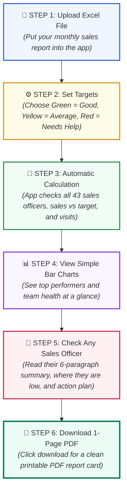
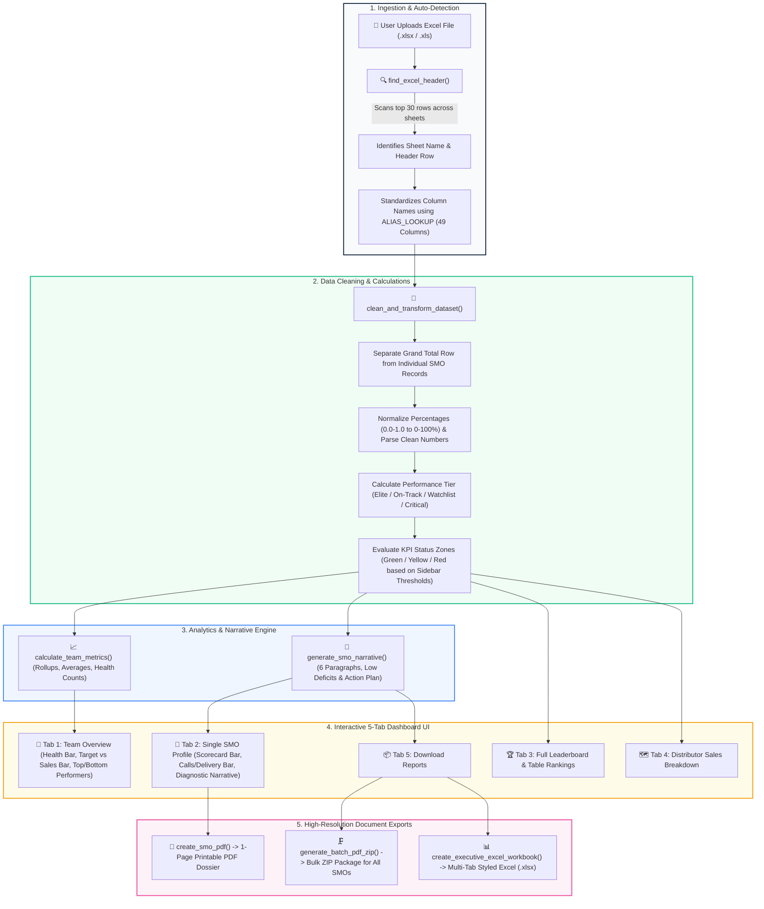
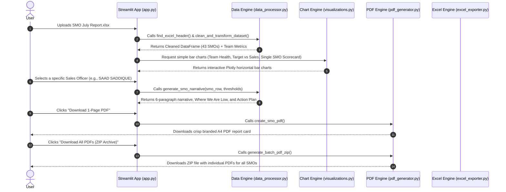

# 🥤 Cola Next SMO KPI Analyzer (Easy Guide & Flowchart)

An easy-to-use tool to analyze sales targets, shop visits, delivery success, and generate 1-page PDF report cards for your sales team.

---

## 🧭 Super Simple 6-Step Flowchart (How It Works)



---

### 📋 What Happens in Each Step (In Plain Words):

1. **Step 1 (Upload):** You upload your monthly sales Excel file (`.xlsx`).
2. **Step 2 (Targets):** You set your standards (e.g., Green = 100% target met, Yellow = 85% acceptable, Red = below 85%).
3. **Step 3 (Calculation):** The app automatically reads each salesperson's numbers, calculates their percentages, and checks if they passed.
4. **Step 4 (Overview):** You see simple, color-coded bar charts showing who made target and who is lagging behind.
5. **Step 5 (Individual Profile):** You pick any salesperson (like *SAAD SADDIQUE*) and get a clear 6-paragraph explanation telling you:
   - How many days they worked.
   - Their sales percentage.
   - Their shop visit completion.
   - Their delivery percentage and GPS accuracy.
   - **Where they are low** and **what specific actions they must take to improve**.
6. **Step 6 (Download):** Click one button to download a clean, printable 1-page PDF report card for that salesperson or download a ZIP file with all report cards.

---

## 📊 Detailed System Architecture Flowchart



---

## 🔄 Detailed Data Pipeline Explained (Step-by-Step)



---

## 📁 Repository Structure & Module Breakdown

| File | Purpose & Responsibilities |
| :--- | :--- |
| [`app.py`](file:///c:/Users/dayan/Desktop/kpi%20report%20analyzer/app.py) | **Main Application Entry Point:** Manages Streamlit state, sidebar KPI thresholds, initial upload screen, global filters, and the 5-tab user interface. |
| [`data_processor.py`](file:///c:/Users/dayan/Desktop/kpi%20report%20analyzer/data_processor.py) | **Core Processing Engine:** Auto-detects Excel headers, maps all 49 potential columns via canonical aliases, cleans nulls/floats, computes performance zones (Green/Yellow/Red), and generates the standardized 6-paragraph narrative and deficit diagnostics. |
| [`visualizations.py`](file:///c:/Users/dayan/Desktop/kpi%20report%20analyzer/visualizations.py) | **Layman-Friendly Charting Engine:** Generates simple, clean horizontal and grouped bar charts with color coding and clear plain-English explanation callouts. Zero complicated scatter plots. |
| [`pdf_generator.py`](file:///c:/Users/dayan/Desktop/kpi%20report%20analyzer/pdf_generator.py) | **Executive PDF Engine:** Uses ReportLab to generate print-ready, high-resolution A4 single-page report cards and bulk ZIP archives. |
| [`excel_exporter.py`](file:///c:/Users/dayan/Desktop/kpi%20report%20analyzer/excel_exporter.py) | **Excel Workbook Exporter:** Uses OpenPyXL to build corporate-styled multi-sheet `.xlsx` files with Executive Summary, Scorecards, and Full Clean Dataset. |
| [`theme.py`](file:///c:/Users/dayan/Desktop/kpi%20report%20analyzer/theme.py) | **Design System & CSS:** Manages Cola Next brand colors (Navy `#0B1E36`, Crimson `#D8232A`, Emerald `#10B981`, Amber `#F59E0B`), high-contrast text styles, and full Light/Dark mode compatibility. |
| [`requirements.txt`](file:///c:/Users/dayan/Desktop/kpi%20report%20analyzer/requirements.txt) | **Dependencies:** Lists required packages (`streamlit`, `pandas`, `openpyxl`, `reportlab`, `plotly`). |

---

## 📖 Layman's KPI Dictionary (What Each Metric Means)

| KPI Metric | Plain English Meaning | Standard Green Goal | Yellow Zone | Red Zone |
| :--- | :--- | :---: | :---: | :---: |
| **Sales Achievement %** | How much of the monthly sales target was actually sold. | **≥ 100%** | 85% to 99% | < 85% |
| **Shop Visit Completion %** | What percentage of scheduled store visits were actually made. | **≥ 95%** | 85% to 94% | < 85% |
| **Order Strike Rate %** | Out of the shops visited, how many actually placed an order. | **≥ 80%** | 65% to 79% | < 65% |
| **GPS Location Accuracy %** | Percentage of shop check-ins that occurred directly inside the store. | **≥ 90%** | 75% to 89% | < 75% |
| **Delivered Cases %** | Percentage of booked orders that were successfully delivered to retailers. | **≥ 90%** | 80% to 89% | < 80% |
| **Field Working Days** | Number of active field days the sales officer worked in the month. | **≥ 18 Days** | 15 to 17 Days | < 15 Days |

---

## 🚀 How to Run the Application

### 1. Install Dependencies
```bash
pip install -r requirements.txt
```

### 2. Launch the Streamlit App
```bash
python -m streamlit run app.py
```

### 3. Open in Browser
Visit **`http://localhost:8501`** in any web browser.

---

## 💡 Using the App
1. **Upload Report:** On the home screen, drag and drop your Excel report (or click *▶️ Load Sample July Report* for a quick test).
2. **Set Thresholds:** Adjust minimum target levels in the sidebar if needed.
3. **Analyze:**
   - **Tab 1 (Team Overview):** High-level summary, health distribution bar chart, and top/bottom performers.
   - **Tab 2 (Single SMO):** Individual performance scorecard bar chart, 6-paragraph narrative, "Where We Are Low" deficits, "What to Enhance" action plan, and 1-click PDF download.
   - **Tab 3 (Ranking):** Sortable team leaderboard.
   - **Tab 4 (Distributor Sales):** Target vs sales comparison by distribution center.
   - **Tab 5 (Download Reports):** Download all individual PDFs in a ZIP file or download the executive Excel workbook.
